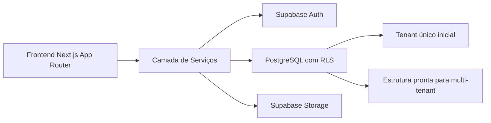
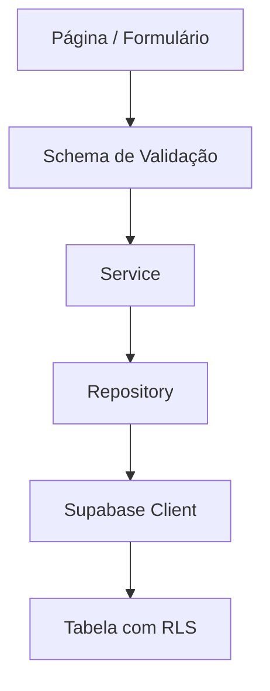
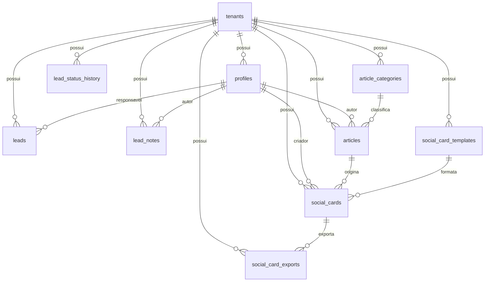

## 1. Desenho de Arquitetura

## 2. Descrição Tecnológica
- Frontend: `Next.js` com `App Router`, TypeScript e Server Components quando fizer sentido.
- Estilo: `Tailwind CSS` com tokens de design para azul profundo, prata e vermelho metálico.
- Backend BaaS: `Supabase` para autenticação, banco PostgreSQL, RLS e storage.
- Validação: `zod` para schemas de entrada e consistência entre formulário, serviço e banco.
- Estado de UI: estado local e composição do próprio React; sem complexidade adicional no MVP.

## 3. Estrutura de Pastas
| Caminho | Responsabilidade |
|-------|---------|
| `src/app` | Rotas públicas, autenticadas, layouts e handlers |
| `src/components` | Componentes visuais reutilizáveis |
| `src/features` | Módulos por domínio: auth, leads, artigos, cards, categorias |
| `src/lib` | Clientes Supabase, helpers, validações e constantes |
| `src/services` | Regras de negócio e orquestração |
| `src/repositories` | Acesso a dados e consultas organizadas |
| `supabase/migrations` | Versionamento SQL do banco |
| `public` | Fontes, imagens e ativos públicos |

## 4. Definição de Rotas
| Rota | Finalidade |
|-------|---------|
| `/` | Home institucional |
| `/escritorio` | Posicionamento e diferenciais |
| `/artigos` | Lista de artigos publicados |
| `/artigos/[slug]` | Detalhe do artigo |
| `/contato` | Conversão de leads |
| `/login` | Acesso interno da equipe |
| `/dashboard` | Resumo operacional |
| `/dashboard/leads` | CRM de leads |
| `/dashboard/leads/[id]` | Detalhe do lead |
| `/dashboard/artigos` | Gestão editorial |
| `/dashboard/cards` | Geração de cards estáticos |
| `/dashboard/configuracoes` | Ajustes administrativos básicos |

## 5. Arquitetura de Aplicação

## 6. Modelo de Dados
### 6.1 Entidades principais
- `tenants`: tenant operacional do escritório, já preparado para expansão futura.
- `profiles`: extensão de `auth.users` com papel, vínculo ao tenant e dados operacionais.
- `leads`: oportunidade comercial com status, origem, responsável e consentimento.
- `lead_status_history`: histórico auditável de transições de status.
- `lead_notes`: observações internas por lead.
- `article_categories`: categorias editoriais para SEO e organização temática.
- `articles`: conteúdo jurídico com status editorial e metadados de SEO.
- `social_card_templates`: presets visuais dos cards.
- `social_cards`: cards gerados no painel.
- `social_card_exports`: metadados dos arquivos exportados.

### 6.2 Modelo relacional

## 7. DDL Inicial Planejada
### 7.1 Convenções
- Todas as tabelas de negócio terão `id`, `tenant_id`, `created_at` e `updated_at` quando aplicável.
- O tenant inicial será inserido como seed controlada.
- `tenant_id` será obrigatório nas tabelas principais para permitir futuras policies multi-tenant.

### 7.2 Tabelas previstas
- `tenants`
- `profiles`
- `leads`
- `lead_status_history`
- `lead_notes`
- `article_categories`
- `articles`
- `social_card_templates`
- `social_cards`
- `social_card_exports`

### 7.3 Status e enums lógicos
- Leads: `especulacao`, `novo`, `em_analise`, `contato_realizado`, `proposta_enviada`, `cliente_convertido`, `encerrado`, `descartado`
- Artigos: `draft`, `review`, `published`, `archived`
- Cards: `draft`, `ready`
- Papéis: `super_admin`, `admin`, `advogada`, `assistente`
- Formatos de card: `square`, `vertical`

## 8. RLS e Segurança
- RLS ativa em todas as tabelas de negócio.
- Políticas baseadas em `tenant_id` para isolamento por escritório.
- Leitura pública apenas para artigos `published` e dados públicos estritamente necessários.
- Leads, notas e histórico ficam restritos a usuários autenticados do tenant.
- Uploads no storage usarão paths segmentados por tenant.
- O `service_role` nunca será exposto ao cliente.

## 9. Decisões Técnicas Registradas
- Arquitetura inicial: modular monolith com separação forte por domínio.
- Estratégia de autenticação: Supabase Auth com tabela `profiles` complementar.
- Estratégia de SEO: artigos e categorias já no MVP.
- Estratégia de cards: geração estática client-side com download no navegador.
- Estratégia de evolução: manter compatibilidade com SaaS futuro sem aumentar a complexidade operacional do MVP.
