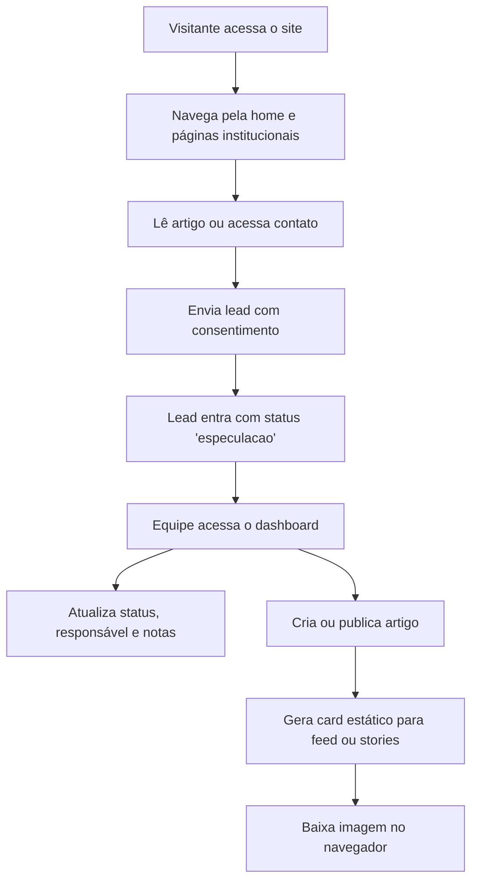

## 1. Visão do Produto
Aplicação full-stack modular para um escritório de advocacia boutique de luxo, com site institucional premium e painel interno exclusivo para equipe.
- Resolve presença digital, captação de leads, gestão editorial e produção rápida de cards sociais com base jurídica confiável.
- Nasce como operação de tenant único, mas pronta para evoluir para SaaS multi-tenant sem retrabalho estrutural.

## 2. Funcionalidades Centrais

### 2.1 Perfis de Usuário
| Papel | Método de acesso | Permissões centrais |
|------|-------------------|---------------------|
| Visitante | Navegação pública | Visualizar site, artigos e enviar lead |
| Admin | Login por e-mail | Gerenciar conteúdo, leads, categorias, templates e configurações |
| Advogada | Login por e-mail | Gerenciar artigos, leads, cards e ativos do escritório |
| Assistente | Login por e-mail | Atualizar leads, apoiar conteúdo e gerar cards |

### 2.2 Módulos do Produto
1. **Site institucional**: hero premium, apresentação do escritório, diferenciais, CTA e formulário de contato.
2. **Artigos**: listagem por categoria, página de detalhe, SEO orgânico e publicação controlada.
3. **Painel interno**: autenticação, dashboard executivo, CRM de leads, artigos e gerador de cards.
4. **Gerador de cards**: geração de artes estáticas em formatos quadrado e vertical com download client-side.

### 2.3 Detalhamento de Páginas
| Nome da página | Módulo | Descrição funcional |
|-----------|-------------|---------------------|
| Home | Hero institucional | Destaca autoridade, proposta de valor, áreas de atuação e CTA principal |
| Escritório | Apresentação | Reforça posicionamento boutique, credibilidade e diferenciais da marca |
| Artigos | Conteúdo | Lista artigos publicados com filtro por categoria e CTA para contato |
| Artigo | Conteúdo editorial | Exibe artigo completo, SEO, CTA contextual e categoria vinculada |
| Contato | Captação | Recebe leads com consentimento LGPD e origem do contato |
| Login | Acesso interno | Autentica equipe via Supabase Auth |
| Dashboard | Painel | Resume leads, artigos, cards e indicadores operacionais |
| Leads | CRM | Lista, filtra, altera status, atribui responsável e registra notas |
| Artigos - Gestão | CMS | Cria, edita, publica e arquiva artigos por categoria |
| Cards | Social media | Gera e baixa cards estáticos para feed e stories |
| Configurações | Administração | Define tenant atual, identidade visual operacional e preferências básicas |

## 3. Fluxos Principais
- Visitante acessa o site, percebe autoridade da marca, lê artigos e envia um lead.
- A equipe acessa o painel, classifica o lead a partir de `especulacao` e acompanha o funil.
- A advogada ou assistente publica artigos por categoria e usa esse conteúdo para gerar cards sociais.

## 4. Interface e Design
### 4.1 Direção Visual
- Estilo: minimalista, imponente, luxuoso e contemporâneo.
- Cor principal: azul profundo como base da experiência.
- Cor do texto: prata com alto contraste e leitura elegante.
- Cor de acento: vermelho metálico aplicado apenas em microdetalhes de alto impacto.
- Tipografia: serifada refinada para títulos e sans clean para interface e leitura.
- Layout: editorial premium, muito respiro, linhas finas, ritmo visual sóbrio e blocos amplos.

### 4.2 Resumo de UI por Página
| Página | Módulo | Elementos de interface |
|-----------|-------------|-------------|
| Home | Hero | Tipografia de impacto, CTA com borda fina vermelha, fundo azul profundo, brilho metálico sutil |
| Escritório | Conteúdo institucional | Blocos editoriais, divisórias delicadas, fotos sóbrias e composição arquitetônica |
| Artigos | Listagem | Cards limpos, categorias discretas, hover elegante e leitura prioritária |
| Contato | Formulário | Campos premium, feedback claro, foco acessível e consentimento destacado |
| Dashboard | Visão executiva | Cards de métricas, tabela refinada, filtros e hierarquia operacional clara |
| Cards | Editor | Pré-visualização em tempo real, seleção de formato e download direto |

### 4.3 Responsividade
- Abordagem desktop-first com adaptação cuidadosa para mobile.
- Tipografia e espaçamentos devem preservar a sensação de luxo também em telas pequenas.
- Formulários, tabelas e editor de cards precisam manter usabilidade em toque.

## 5. Requisitos de Negócio
- `cartao/` permanece isolada e não faz parte do escopo técnico do novo projeto.
- O painel interno é exclusivo para Simone e sua assistente nesta fase.
- Categorias de artigos entram no MVP para fortalecer SEO orgânico.
- O módulo de cards do MVP entrega imagens estáticas em `quadrado` e `vertical`.
- O banco deve nascer com `tenant_id`, `RLS` ativo e políticas prontas para expansão SaaS.
